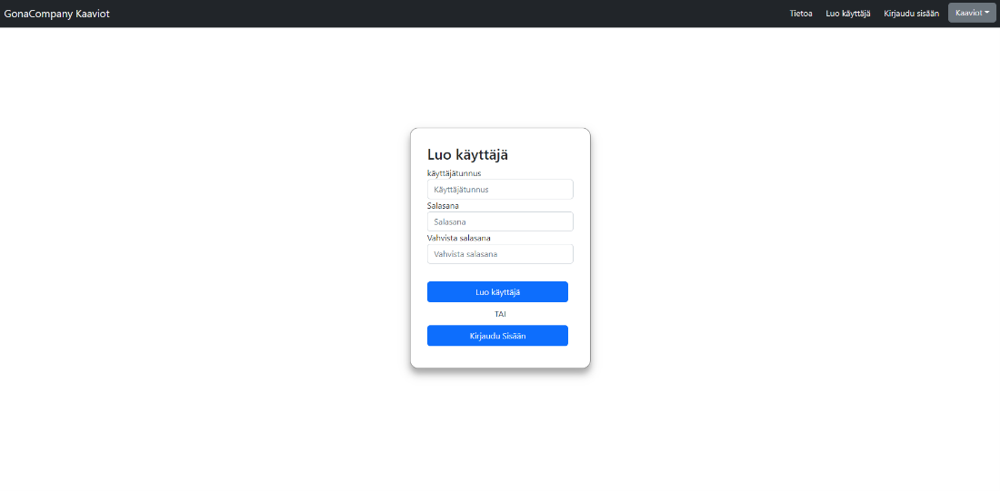
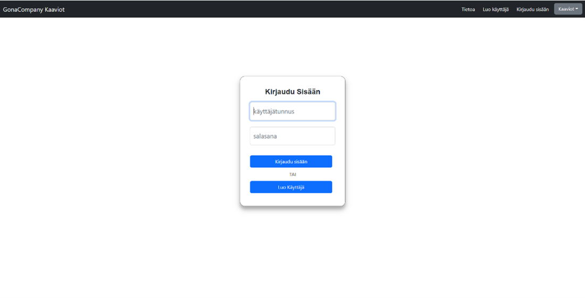

GonaCompany Kaaviot - Kaaviodatapalvelu
=======================================

Tekijät: Mike Huovinen, Julius Häikiö, Ville-Valtteri Yritys, Hermanni Huotari

Esittely
--------
GonaCompany Charts on Oulun ammattikorkeakoulun 2. vuoden opiskelijoiden kehittämä visualisointityökalu, joka esittää ilmastonmuutokseen liittyvää tietoa kaavioissa. Sovellusprojekti on toteutettu käyttäen React-teknologiaa selaimessa ja Java-teknologiaa palvelimessa. Projektissa toteutettiin web-pohjainen REST API -sovellus, jossa käyttäjä voi selata ilmastonmuutokseen liittyviä kaavioita ja luoda omia näkymiä yhdistäen valitsemiaan kaavioita. Tietokantana toimii MySQL-palvelin, johon data siirrettiin suurimmalta osin suoraan Excelistä SQL-komentoja käyttäen. Kaikki projektissa käytetty data on julkisesti saatavilla ja lähteet on mainittu kaavioissa.

Sovelluksen toteutus
--------

Käyttöliittymän yläpalkista löytyy painikkeet sisään- ja uloskirjautumiseen sekä käyttäjän luomiseen (kuva 1). Lisäksi painikkeiden vieressä on pudotusvalikko, jonka kautta pääsee katsomaan lämpötila- ja päästökaavioita, ja halutessaan käyttäjä voi luoda näistä oman näkymän.

**KUVA 1.** _Käyttöliittymän yläpalkki_

**Kuva 2.** _Luo käyttäjä -näkymä_

**Kuva 3.** _Kirjaudu sisään -näkymä_

**Kuva 4.** _Lämpötilakaaviot -sivu avattuna_

**Kuva 5.** _Päästökaaviot -sivu avattuna_

**Kuva 6.** _Oman näkymän luonti -sivu avattuna_

**Kuva 7.** _Oman näkymän luonti -sivu avattuna_

