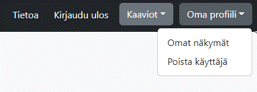
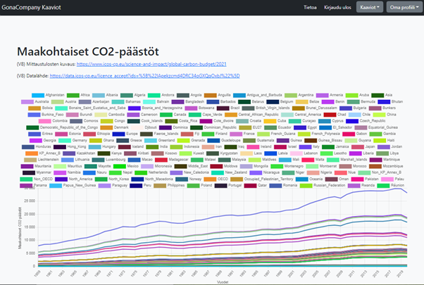
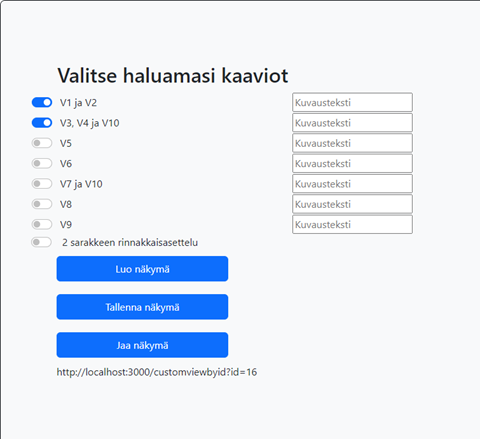
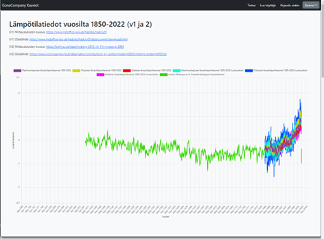
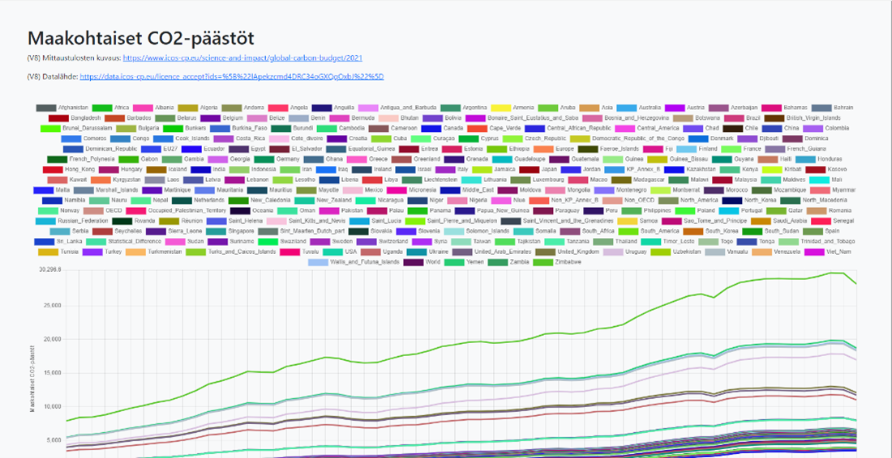
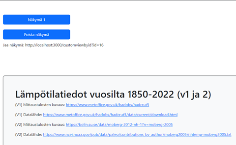

GonaCompany Kaaviot - Kaaviodatapalvelu
=======================================

Tekijät: Mike Huovinen, Julius Häikiö, Ville-Valtteri Yritys, Hermanni Huotari

Esittely
--------
GonaCompany Charts on Oulun ammattikorkeakoulun 2. vuoden opiskelijoiden kehittämä visualisointityökalu, joka esittää ilmastonmuutokseen liittyvää tietoa kaavioissa. Sovellusprojekti on toteutettu käyttäen React-teknologiaa selaimessa ja Java-teknologiaa palvelimessa. Projektissa toteutettiin web-pohjainen REST API -sovellus, jossa käyttäjä voi selata ilmastonmuutokseen liittyviä kaavioita ja luoda omia näkymiä yhdistäen valitsemiaan kaavioita. Tietokantana toimii MySQL-palvelin, johon data siirrettiin suurimmalta osin suoraan Excelistä SQL-komentoja käyttäen. Kaikki projektissa käytetty data on julkisesti saatavilla ja lähteet on mainittu kaavioissa.

Sovelluksen toteutus
--------

Käyttöliittymän yläpalkista löytyy painikkeet sisään- ja uloskirjautumiseen sekä käyttäjän luomiseen. Lisäksi painikkeiden vieressä on ”Kaaviot” -pudotusvalikko, jonka kautta pääsee katsomaan lämpötila- ja päästökaavioita, ja halutessaan käyttäjä voi luoda näistä oman näkymän. 
Pudotusvalikosta valittu ensimmäinen näkymä ”Lämpötilatiedot ja CO2 pitoisuudet” (kuva 1) näyttää sivulla kaaviot V1–V7 sekä V10. Kaaviot näkyvät allekkain ja käyttöliittymä skaalautuu, mikäli selaimen ikkunan kokoa muutetaan.

**KUVA 1.** _Lämpötilatietojen CO2 pitoisuuksien näkymä_

Valikon toisesta näkymästä voi tarkastella CO2-päästölähteitä toimiala- ja maakohtaisesti. (kuva 2)

**Kuva 2.** _Päästökaaviot  -sivu avattuna_

Käyttäjän omat näkymät
--------

Sovelluksessa on mahdollista luoda omia näkymiä sekä tallentaa ja jakaa niitä muille. (kuvat 3 ja 4)

Kyseinen toiminto on näkyvissä vain kirjautuneelle käyttäjälle. Käyttäjä voi valita haluamansa kaaviot näkymälleen ja myös halutessaan asettaa kaavioille omat kuvaustekstit. Painamalla ”Luo näkymä” -nappia sovellus näyttää käyttäjän valitsemat kaaviot halutulla asettelulla joko allekkain tai rinnakkain.

**Kuva 3.** _Oman näkymän luonti  -sivu avattuna_

Kirjautunut käyttäjä voi selata luomiaan näkymiä oman profiilinsa kautta. Näkymiä on myös mahdollista jakaa linkillä eikä sen katsominen vaadi kirjautumista. Itse tehdyt näkymät voi poistaa halutessaan.

**Kuva 4.** _Tallennettujen näkymien -sivu avattuna_

**Kuva 5.** _Päästökaaviot -sivu avattuna_

**Kuva 6.** _Oman näkymän luonti -sivu avattuna_

**Kuva 7.** _Tallennettujen näkymien -sivu avattuna_

